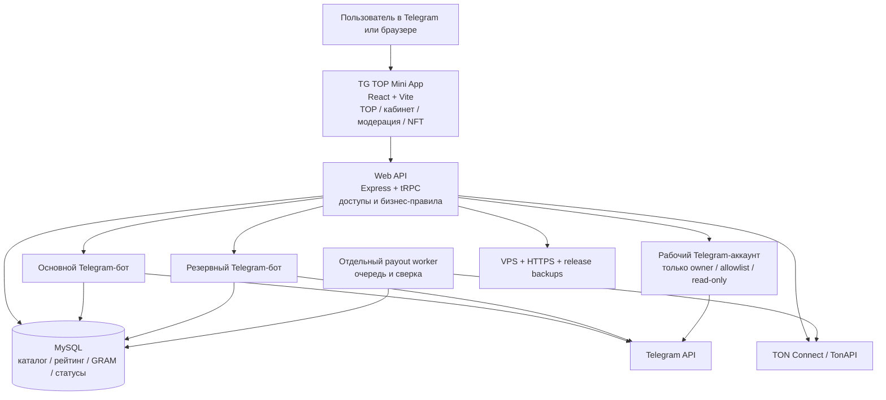

# TG TOP — что реально готово и что критично закрыть до нормального запуска

**Проверено:** 27 августа 2026 года.  
**Исходный код:** checkpoint `205c542`.  
**Production:** `tgtop.me`; все пять сервисов активны; public health отвечает `200`; production dependency audit не нашёл известных уязвимостей.

> **Честный вывод:** TG TOP уже не «пустой макет» и не одноразовый прототип. Каталог, TOP, рабочее пространство, модерация, боты, внутренний GRAM, кошелёк и Telegram-аналитика существуют. Но это ещё **функциональная beta**, а не готовая к масштабированию площадка. Главная проблема — не отсутствие функций, а то, что слишком много разных сценариев собрано и дорабатывалось в одних и тех же больших модулях. Поэтому одна правка иногда цепляет другой экран.

## 1. Стадия проекта без приукрашивания

| Блок | Оценка | Что уже есть | Что пока не даёт назвать это готовым релизом |
|---|---:|---|---|
| TOP и каталог сообществ | **7/10** | Карточки, рейтинг, поиск, фильтры, публичные и приватные ссылки, снятие с листинга. | Нужна серия реальных пользовательских проверок: добавить бота → увидеть группу → разместить → снять → открыть ссылку. |
| Рабочее пространство владельца | **6/10** | Список своих групп, настройки листинга, менеджеры, награды, карточка сообщества. | Экран стал перегруженным; надо разнести управление, статистику и ставку на независимые блоки и проверить на телефоне. |
| Telegram-боты | **6/10** | Основной и резервный бот, проверка прав, события, инвайт-ссылки, уведомления. | Нужны мониторинг, понятные ошибки и реальные проверки отказов Telegram, а не только тесты кода. |
| Модерация | **6/10** | Роли, ручное снятие, причины, журнал, заявки ботов. | Нужна короткая и стабильная панель без неясных состояний и повторов. |
| Официальная Telegram-аналитика | **5/10** | Для allowlisted `@TGTOP_Community` уже приходят реальные графики Telegram. | Нужна сверка каждого ключевого графика с нативной статистикой Telegram и отдельный нормальный экран, а не продолжение админ-формы. |
| GRAM / деньги | **4/10** | Журнал, intents, депозиты, заявки вывода, отдельный worker и защита от повторов. | Любые деньги требуют controlled E2E-проверок, мониторинга и операционного процесса. Расширять эту часть сейчас нельзя. |
| Код и поддерживаемость | **3/10** | TypeScript, 81 тестовый файл, 193 passing tests, staged release. | Главные файлы слишком большие, а часть тестов проверяет текст кода вместо поведения пользователя. |
| Production-эксплуатация | **5/10** | HTTPS, health endpoint, staged backup/rollback, пять активных сервисов. | Обнаружен реальный operational bug: старые runtime-backups заполнили диск и сорвали один release. Нужны retention и alerts. |

## 2. Архитектура сейчас — простая карта

| Слой | Реальная роль | Что важно понимать |
|---|---|---|
| **Mini App** | То, что видит пользователь: TOP, карточки, кабинет, модерация. | Сейчас почти всё живёт в одном `Home.tsx` — **5 607 строк**. Это главный источник UI-каскадных багов. |
| **API** | Проверяет доступ, считает рейтинг, принимает действия, отдаёт данные. | `routers.ts` — **782 строки** и содержит слишком много разных доменов в одном месте. |
| **База** | Источник истины: пользователи, группы, ставки, балансы, статусы, аудит. | `db.ts` — **3 160 строк**; он одновременно repository, правила, workflow и часть очередей. |
| **Telegram-боты** | Подключение сообществ, права админа, обновления, ссылки, события. | Два бота повышают устойчивость, но не заменяют мониторинг и реальные E2E-проверки. |
| **Рабочий Telegram-аккаунт** | Owner-only, зашифрованная server-side session, read-only analytics allowlist. | Может получать официальную агрегированную статистику; не должен читать личку/посты или делать записи без отдельного разрешения. |
| **Финансовый worker** | Отдельно обрабатывает очереди и сверку вывода. | Это правильно изолировано от web-сервера, но требует особого операционного контроля. |
| **VPS / release** | Хостинг, сервисы, reverse proxy, backup и rollback. | Release есть и работает, но накопление backup-архивов уже привело к заполнению диска. |

## 3. Почему ощущается как «полурабочее»

Это не один катастрофический баг. Это **накопленный архитектурный долг**: продукт быстро рос, а сценарии добавлялись поверх уже работающих экранов. В результате на одном экране смешаны каталог, кошелёк, листинг, ставка, модерация, NFT и аналитика. На сервере похожая ситуация: одни файлы содержат сразу правила, доступы, работу с базой и workflow.

| Подтверждённый факт | Как это проявляется для тебя |
|---|---|
| `Home.tsx` — 5 607 строк | Небольшая правка кнопки или карточки может неожиданно задеть другое окно. |
| `db.ts` — 3 160 строк | Сложно быстро понять, где именно меняется баланс, позиция рейтинга или статус. |
| 193 теста проходят, но часть из них source-contract tests | Код может пройти тест, но пользовательский путь в Telegram всё равно окажется неудобным или сломанным. |
| Production имеет 5 active services, но за 24 часа есть warning-сигналы | Сервис «жив», но без разбора причин предупреждений нельзя уверенно наращивать нагрузку. |
| Диск VPS один раз дошёл до 100% | Новый release не прошёл, потому что runtime-backups росли без retention. Я освободил место, сохранив 5 свежих точек восстановления; это надо автоматизировать. |

## 4. Что критично сделать **до** добавления новых функций

### P0 — начать сразу

| Приоритет | Что закрыть | Результат, который можно проверить |
|---|---|---|
| **P0.1** | Починить release storage: retention для старых backup-архивов, проверка свободного места до release, alert при заполнении. | Release не может стартовать, если нет места на безопасный backup; сохраняется заданное число точек rollback. |
| **P0.2** | Разобрать warning-сигналы web, payout worker и owner worker; добавить безопасные error IDs. | Любая ошибка получает понятный идентификатор и видна как причина, а не как «что-то не работает». |
| **P0.3** | Заморозить новые marketplace/финансовые функции и составить единый список реально работающих сценариев. | Нет новых «костылей» поверх непроверенной основы. |
| **P0.4** | Пройти реальные Telegram E2E-пути на одном тестовом/разрешённом сообществе. | Ясно подтверждены или исправлены: вход, добавление бота, появление группы, листинг, снятие, переход по ссылке, модерация. |

### P1 — после P0

| Приоритет | Что сделать | Зачем |
|---|---|---|
| **P1.1** | Разделить `Home.tsx` на пять экранов: TOP, детали сообщества, рабочее пространство, кабинет/кошелёк, админка. | UI-поправки перестанут ломать соседние сценарии. |
| **P1.2** | Разделить API и `db.ts` по доменам: `catalog`, `ranking`, `wallet`, `moderation`, `telegram`, `analytics`. | Будет понятно, где искать и исправлять проблему. |
| **P1.3** | Сделать smoke-test checklist и компактные E2E-тесты именно для реальных путей пользователя. | «Тесты зелёные» будет означать, что ключевые кнопки и статусы действительно работают. |
| **P1.4** | Отдельно оформить экран Telegram-аналитики и сверить его с нативной статистикой Telegram. | Аналитика будет восприниматься как продуктовая часть TG TOP, а не технический блок админки. |

### P2 — только затем

| Направление | Когда имеет смысл |
|---|---|
| CDN/WAF, traffic alerts, metrics | До первой активной волны пользователей и листингов. |
| Code splitting и облегчение клиентского JS | После разделения экранов; текущий browser bundle около 685 KB gzip. |
| NFT-аренда, сделки, Stories, новые деньги | Только когда P0/P1 закрыты и ключевые сценарии стабильно проходят. |

## 5. Что должно считаться «готовым рабочим релизом»

Не «все идеи реализованы». Рабочий релиз — это когда нижний список проходит без ручных костылей дважды подряд:

1. Пользователь открывает Mini App и видит корректный свой статус.
2. Добавляет бота администратором своего сообщества и видит его в «Рабочем пространстве».
3. Настраивает и подтверждает листинг; TOP и карточка сразу согласованы.
4. Снимает листинг; карточка пропадает только из ТОПа, а группа остаётся у владельца.
5. Публичная и приватная кнопка «Перейти» ведут только к подтверждённой актуальной ссылке.
6. Администратор видит активный лот, может снять его с причиной, а владелец получает понятное уведомление.
7. Баланс, ставка и история не расходятся после перезагрузки.
8. Release проходит при нормальном запасе диска, health всех сервисов зелёный, а rollback доступен.

> До выполнения этих восьми пунктов я не считаю правильным добавлять новые большие направления. Сначала делаем площадку **предсказуемой**, затем масштабируем.

## 6. Правильный порядок работы теперь

1. **Стабилизировать production:** storage retention, свободное место, warning audit, базовые alerts.
2. **Пройти реальные пользовательские пути:** без фейковых данных, без новых функций, с фиксацией каждого фактического бага.
3. **Разнести монолиты:** сперва интерфейс, потом router и data/workflow слои; каждый перенос покрыть тестами.
4. **Собрать release candidate:** только исправления, E2E-проверка, staged release, короткий acceptance checklist.
5. **После этого** — официальный запуск первых 100 групп и дальнейшие продуктовые расширения.

## 7. Что я предлагаю начать первым

Первый стабилизационный блок: **починить release-storage, безопасно разобрать warning-сигналы и сделать один список из ключевых реальных путей пользователя**. Это уберёт риск «не могу выкатить правку», даст видимость проблем и прекратит хаотичные изменения. После этого берём первый настоящий путь — добавление и листинг сообщества — и доводим его до стабильного состояния от Telegram до карточки TG TOP.
