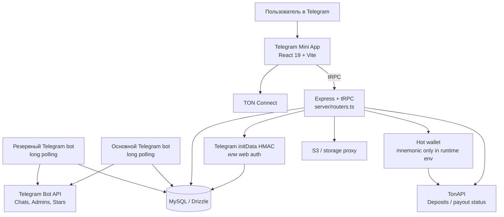
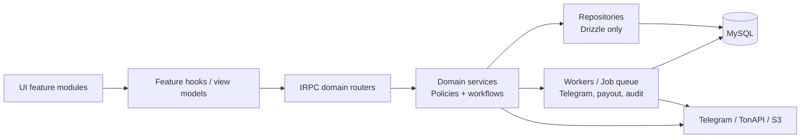

# Архитектурный аудит TG TOP

**Дата:** 26 августа 2026 года  
**Версия исходного кода:** `bfee14c`  
**Статус аудита:** codebase, автоматические проверки, публичный HTTP-периметр и dependency audit. Денежные операции, выплаты, переводы NFT и изменения production-данных **не выполнялись**.

> **Короткий вывод:** TG TOP уже не прототип «из одной страницы». Это работающий **production MVP / ранняя beta-платформа** с реальным Telegram Mini App, каталогом, рейтингом, модерацией, Telegram-ботами, internal GRAM, Stars и технически реализованным TON-контуром. Главная проблема сейчас — не отсутствие функций, а необходимость стабилизировать финансовые и конкурентные операции, укрепить production-периметр и разделить крупные монолитные модули до дальнейшего расширения продукта.

## 1. Текущая стадия проекта

| Направление | Оценка зрелости | Фактическое состояние | Что отделяет от следующей стадии |
|---|---:|---|---|
| Продукт и UX | **3/5** | Есть полноценный Mini App: ТОП, детали сообществ, кабинет, модерация, боты, NFT-витрина, подарки, статистика. | Упростить пользовательские сценарии и снять накопившиеся UI-регрессии. |
| Telegram-интеграция | **3/5** | Основной и резервный боты, onboarding, права админа, события, rewards, Stars callbacks, проверка entry links. | Наблюдаемость, lock на poller, сценарии реального отказа и автоматическое восстановление. |
| Данные и рейтинг | **3/5** | 23 таблицы, 51 миграция, индексы, идемпотентные event receipts, ranking intents. | Транзакционная защита конкурирующих ставок, FK/инварианты и единая денежная модель. |
| Авторизация и доступы | **3/5** | Server-side Telegram `initData` HMAC, protected API, moderator/admin роли. | Разделить privileged procedures, telemetry и более строгую сессию для финансовых мутаций. |
| Финансовая готовность | **1.5/5** | TON deposits/withdrawals и hot-wallet механика реализованы технически; есть limits, idempotency и сверка. | Нельзя безопасно масштабировать или расширять до P0/P1 hardening, внешнего аудита и ручных operational controls. |
| Operations / SRE | **2/5** | VPS-release с backup/rollback, три сервиса, публичный HTTPS. | Health/readiness, rate limits, CSP/HSTS, structured logs, alerts, DB/queue monitoring, incident runbooks. |
| Поддерживаемость | **2/5** | Тесты и строгий TypeScript есть, но ключевые модули стали монолитами. | Декомпозиция UI, router, data/service слоёв и интеграционные тесты. |

**Итоговая оценка:** проект находится в конце фазы **«функциональный production MVP»** и в начале фазы **«стабилизация перед ростом»**. Сейчас правильнее инвестировать в надёжность и архитектуру, а не добавлять ещё один финансовый или marketplace-модуль.

## 2. Как система устроена сейчас

### 2.1. Клиент

Клиент работает как Telegram-native SPA. `App.tsx` поднимает общий TonConnect provider, тему, toaster и launch screen. Главная страница — единый workflow-контейнер для публичного ТОПа, деталей сообщества, рабочего пространства, профиля, кошелька, модерации, NFT и каталога ботов.

Это позволило быстро собирать продукт и удобно реагировать на обратную связь. Но сейчас весь пользовательский workflow сосредоточен в `client/src/pages/Home.tsx`: **5 380 строк**, около **125 `useState`**, **31 query**, **40 mutation** и **15 effects**. Такой объём неизбежно делает изменения в одном экране рискованными для другого.

### 2.2. API и доменная логика

`server/routers.ts` — tRPC-контракт из 79 endpoint declarations. В нём одновременно живут:

| Домен | Примеры возможностей |
|---|---|
| Каталог и рейтинг | ТОП, ставки, слоты, listing, география, карточки |
| Сообщества | менеджеры, entry links, статистика, анонимность |
| Модерация | боты, сообщества, роли, taxonomy |
| Internal GRAM и Stars | ledger, списания, ranking intents, invoice callbacks |
| TON | депозиты, quote, выводы, ручная проверка, reconciliation |
| NFT и сделки | showcases, off-chain transfer, аренда, protected deals |

`server/db.ts` содержит 2 862 строки и около 105 экспортируемых helper-функций. Это фактически одновременно repository, domain service, ledger, workflow engine и часть background-job логики. Сейчас он работает, но это крупнейшая точка архитектурного долга на сервере.

### 2.3. Telegram-слой

Два bot-service используют общий `telegramBot.ts`. Боты получают onboarding, статусы админов, membership events, rewards, Stars pre-checkout и success callbacks, создают проверяемые invite links и периодически валидируют entry links. Таблица `telegram_event_receipts` помогает безопасно пропускать дублирующиеся Telegram updates.

Важно: резервный бот — это **второй бот с отдельным токеном**, а не автоматическое переключение одного bot token между серверами. Он снижает зависимость от одного бота, но не заменяет полноценный distributed poller lock, мониторинг 409 Conflict и runbook восстановления.

### 2.4. Данные

Схема содержит 23 таблицы, включая users, catalog, ranking, bids, rewards, Stars intents, TON deposits/withdrawals, moderation, NFT, transfers и deals. Сильные стороны:

| Уже есть | Зачем это важно |
|---|---|
| Уникальные `chatId`, event receipts, payment payloads и transaction hashes | Защита от повторной доставки и двойной обработки. |
| Idempotency key на TON-вывод | Снижает риск двойной заявки пользователя. |
| Индексы по owner, статусу, времени и фильтрам | Основа для каталогов и рабочих очередей. |
| Отдельные статусы intents / withdrawals / deals | Есть зачаток неизменяемого workflow, а не один boolean. |

Главный недостаток: в Drizzle schema нет внешних ключей. `groupId`, `slotId`, `nftId`, `userOpenId` и другие связи обеспечиваются приложением. Это приемлемо в раннем MVP, но опасно для денежных журналов и ручных миграций.

## 3. Подтверждённые риски и приоритеты

### P0 — закрыть до расширения финансов и масштабирования

| Риск | Почему это важно | Подтверждение | Безопасное решение |
|---|---|---|---|
| **Гонка конкурирующих ставок и списаний GRAM** | Две близкие ставки могут рассчитываться на устаревшей доске; списание и перестроение рейтинга происходят разными транзакциями. | `payRankingBidWithGramCredit` списывает balance до `placeBid`; `placeBid` читает доску до своей transaction и обновляет без CAS по ревизии. | Одна transaction: заблокировать целевую доску, проверить актуальный bid/revision, списать GRAM, записать intent, перестроить slots; на UI передавать `expectedUpdatedAt`/revision. |
| **Critical dependency advisory** | `pnpm audit --prod` сообщает 1 critical advisory: transitive `fast-xml-parser` <5.3.5 через AWS SDK tree. Эксплуатация через TG TOP не подтверждена, но обновление обязательно. | Audit: CVE-2026-25896 / GHSA-m7jm-9gc2-mpf2. | Отдельная ветка dependency upgrade, lockfile review, `pnpm test`, build и smoke. Не смешивать с feature-работой. [1] |
| **Горячий кошелёк в runtime environment** | Код умеет подписывать реальный payout BOC. При росте лимитов или ошибке операционного доступа последствия материальны. | Mnemonic читается из env, валидируется и сопоставляется с payout address. | До расширения: feature flag по умолчанию off, лимиты, двухэтапный manual review, key rotation plan. Далее — multisig/custody split или KMS/HSM-стратегия. |
| **In-process payout queue** | Очередь и защита seqno не переживают restart и не работают между несколькими web instances. | `payoutQueue` — Promise в памяти Node process. | MySQL advisory lock / job table сначала; затем отдельный worker + distributed lock per payout wallet. |

### P1 — сделать в ближайшем стабилизационном спринте

| Риск | Наблюдение | Рекомендация |
|---|---|---|
| HTTP hardening | На публичной главной отсутствуют HSTS, CSP, `X-Content-Type-Options`, `Referrer-Policy`, `Permissions-Policy`; видны `Server` и `X-Powered-By`. | Настроить Nginx security headers, скрыть disclosure headers, сформировать CSP с Telegram WebApp, TonConnect, TonAPI и требуемыми asset origins. |
| Нет rate limiting / readiness / alerting | Express entrypoint ставит parsers и routes, но не содержит rate limiter, health/readiness, request ID или structured audit log. | Rate limit на `/api/trpc`, health endpoint с DB check, alerts owner при DB/polling/payout сбоях, JSON logs. |
| Неоднородное поведение при DB outage | В `db.ts` найдено 40 путей, возвращающих нейтральный ответ при `!db`, и 51 путь с жёсткой ошибкой. | Ввести `requireDb()` для auth, money, ranking и admin операций; публичные read-only данные могут использовать controlled degraded response. |
| Доступы заданы непоследовательно | Есть `adminProcedure`, но основной router использует `protectedProcedure` и 11 ручных проверок moderation access. | Ввести `ownerProcedure`, `moderatorProcedure`, `financeReviewerProcedure`; добавить router authorization tests. |
| 24-часовое Telegram initData окно | HMAC и timing-safe check реализованы правильно, но финансовые запросы получают допустимый initData до 24 часов. | Для finance mutations — более короткий server session / risk TTL, telemetry invalid auth, опционально replay-store hash(initData) с TTL. |

### P2 — архитектурный долг, который надо закрывать планово

| Зона | Сейчас | К чему привести |
|---|---|---|
| `Home.tsx` | 5 380 строк, 125 состояний, все workflow в одном компоненте. | Фичи `top`, `community-detail`, `workspace`, `wallet`, `moderation`, `bot-catalog`; hooks отдельно от view. |
| `db.ts` | Repository + policy + ledger + workflows в одном файле. | Domain services + repositories: `ranking`, `wallet`, `catalog`, `moderation`, `rewards`, `nft/deals`. |
| `routers.ts` | Один flat tRPC router. | Domain subrouters c единой role middleware и явными contracts. |
| Деньги | Int GRAM, decimal TON и строковые legacy prices существуют параллельно. | Typed Money: nanoTON / gramUnits, никакой арифметики строк, immutable ledger и clear conversion boundary. |
| DB relations | Нет FK definitions. | Добавить FK там, где это не мешает текущей миграции; для старых таблиц сначала data-cleanup + referential audits. |
| Тесты | 149 passed, но 24 source-contract tests и только один Playwright file. | Integration suite на тестовой БД + реальные fake API adapters; E2E smoke для критичных user journeys. |
| Bundle | JS bundle 678 KB gzip; Vite сообщает oversized chunk. | Lazy load admin, NFT, moderation, wallet history и Lottie; измерять TTI на типичном Android/Telegram WebView. |

## 4. Что уже защищено хорошо

Нельзя считать проект «хрупким во всём». В коде уже есть важные правильные решения:

1. Telegram `initData` валидируется на сервере HMAC `WebAppData` и через timing-safe comparison, а не доверяется фронтенду.
2. Права на community, manager и channel gifts сверяются с owner на сервере.
3. TON deposit / withdrawal используют idempotency, transaction hash uniqueness, preflight комиссии, status workflow и reconciliation с TonAPI.
4. Entry link больше не строится из слепого старого username: проверяется актуальная связь с Telegram, а устаревшая карточка снимается с ТОПа.
5. Telegram event receipts, reward event uniqueness и Stars payload позволяют защищаться от повторной обработки.
6. Последний полный pipeline проходит: **149 tests passed**, **3 intentionally skipped**, TypeScript и production build успешны.

## 5. Целевая архитектура, чтобы развивать продукт без каскадных поломок

### Границы модулей

| Модуль | Ответственность | Не должен делать |
|---|---|---|
| `ranking` | Лоты, ставки, CAS/locking, placement intents, outbid events. | Вызывать UI или менять кошелёк напрямую. |
| `wallet` | Deposits, withdrawals, ledger, limits, reconciliation. | Знать о рейтинговой визуализации. |
| `community` | Telegram ownership, profile, managers, entry link verification. | Списывать деньги. |
| `catalog` | Listing, filters, taxonomy, public directory. | Подписывать TON-переводы. |
| `moderation` | Queues, reviewer roles, decisions, audit trail. | Хранить policy в React-компоненте. |
| `rewards` | Campaign budgets, invite attribution, reward events. | Создавать рейтинг-слоты. |
| `telegram-worker` | Polling, Telegram calls, event ingestion, outbox. | Содержать core business-policy целиком. |

## 6. Поэтапный план без опасного большого переписывания

### Этап A — стабилизация и безопасность (первый приоритет)

1. Временно заморозить расширение TON payouts, escrow и NFT transfers до выполнения P0.
2. Сделать atomic ranking bid: один transaction, row locks / CAS, деньги + intent + slots вместе.
3. Провести dependency upgrade в изолированной ветке, начиная с critical `fast-xml-parser` path и прямых зависимостей.
4. Настроить Nginx headers, rate limit, health/readiness и alerting.
5. Ввести строгий `requireDb` для money/auth/ranking/admin flows и понятный режим обслуживания для UI.

**Результат:** рейтинговые и денежные операции становятся предсказуемыми, а сервис — наблюдаемым.

### Этап B — выделение финансового и Telegram workflow

1. Перенести wallet, payout reconciliation и deposits в отдельный `wallet` service/repository.
2. Вынести queue из памяти процесса: DB job/outbox + MySQL advisory lock для payout wallet.
3. Добавить poller lock и alert на Telegram 409 conflict / длительное отсутствие updates.
4. Ввести finance reviewer role и audit trail для каждого approve/reject/broadcast.

**Результат:** один restart или будущий autoscaling не приводит к потере контроля над выплатами и bot-workers.

### Этап C — постепенная декомпозиция продукта

1. Разделить `Home.tsx` по feature boundaries без изменения UX.
2. Разделить tRPC router на domain subrouters.
3. Вынести policies из `db.ts`, оставив ему только queries/transactions.
4. Добавить typed Money и план миграции legacy string price fields.
5. Добавить FK постепенно: сначала новые таблицы, затем очищенные legacy relations.

**Результат:** новая фича затрагивает 2–4 модуля, а не один гигантский экран и один гигантский DB file.

### Этап D — quality gate перед каждым заметным релизом

| Проверка | Минимум |
|---|---|
| Unit / policy tests | Новое правило имеет обычный behavioural test, не только source assertion. |
| Integration DB tests | Ranking, ledger, reward и moderation тестируются на транзакциях. |
| E2E smoke | Telegram-like authenticated flow: list → bid → detail → entry; wallet connect; admin action. |
| Migration safety | Up/down strategy, preflight data check, backup и rollback plan. |
| Operations | Health, alert, structured logs, dashboard и owner runbook. |

## 7. Что не стоит делать сейчас

Не рекомендую сейчас:

1. Запускать новые автоматические TON-выплаты или увеличивать лимиты hot wallet.
2. Добавлять escrow, рассрочку, полноценные NFT-onchain transfers или referral payouts поверх текущего финансового ядра.
3. Делать «полный rewrite» фронтенда или сервера. Это сломает работающий Telegram workflow и затянет развитие.
4. Обновлять все 633 зависимости одной командой без изолированной ветки и regression suite.
5. Удалять legacy таблицы/поля до инвентаризации production-данных и миграционного плана.

## 8. Рекомендуемая последовательность следующего месяца

| Неделя | Результат |
|---|---|
| 1 | Atomic ranking bid, critical dependency update, headers/rate limits/health, DB outage policy. |
| 2 | Wallet worker lock, payout audit controls, bot poller lock, integration tests на БД. |
| 3 | Разделение `Home.tsx`: detail/top/workspace/wallet/moderation; no visible product change. |
| 4 | Domain subrouters/services, first E2E smoke suite, release/runbook/alerts. |

После этого можно безопаснее возвращаться к расширению product roadmap: referrals, advanced analytics, NFT workflows, аренда и сделки.

## 9. Доказательства и ограничения аудита

Проверено в текущем окружении: исходный код checkpoint `bfee14c`, 23 таблицы, 51 миграция, 61 test file; полный запуск тестов — 149 passed и 3 skipped; TypeScript и production build успешны. Публичные `tgtop.me`, TON Connect manifest и robots endpoint отдали HTTP 200. Прямой доступ к systemd/VPS-логам не был повторно выполнен в новом sandbox, поскольку ключ release-доступа после sandbox reset отсутствует; это не мешает статическому аудиту, но ограничивает live SRE-проверку.

Dependency audit обнаружил 1 critical, 21 high, 49 moderate и 10 low advisories. Эти цифры отражают dependency tree, а не автоматически подтверждённую эксплуатацию каждого advisory в TG TOP; они должны быть обработаны контролируемым обновлением и threat-model review.

## References

[1]: https://github.com/advisories/GHSA-m7jm-9gc2-mpf2 "GHSA-m7jm-9gc2-mpf2: fast-xml-parser entity encoding bypass"
[2]: https://github.com/advisories/GHSA-43p4-m455-4f4j "GHSA-43p4-m455-4f4j: tRPC form-data prototype pollution advisory"
[3]: https://docs.ton.org/applications/ton-connect/get-started "TON Connect integration and manifest requirements"

