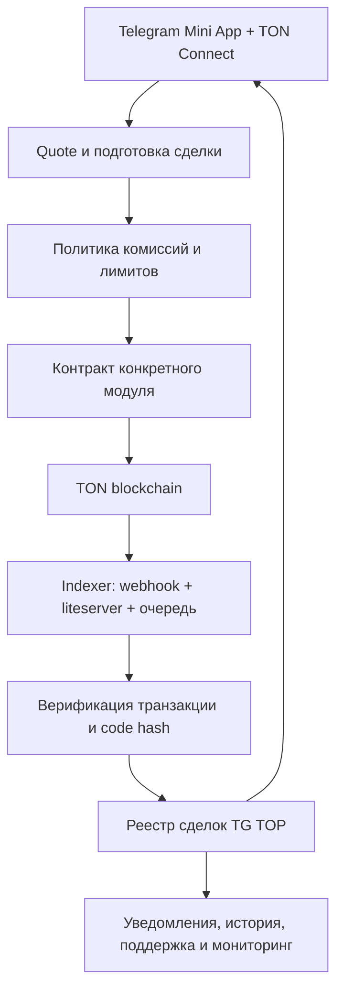

# OOIA → TG TOP: разбор финансовых механизмов и архитектурная карта

**Дата исследования:** 22 августа 2026 года  
**Автор:** Manus AI  
**Статус:** исследование архитектуры; **без внедрения, без деплоя и без запуска платежей**.

## Вывод в одном абзаце

OOIA — не один «готовый маркетплейс», а набор независимых TON-модулей: продажа NFT, аукцион, офферы, P2P-заём под залог, обмен, корзина, raffle, SBT и NFT с будущими jetton-выплатами. Самая ценная часть для TG TOP — не буквальное копирование контрактов, а повторение **дисциплины сделки**: актив проверен, деньги не считаются полученными до on-chain верификации, комиссии определены заранее, операции имеют конечные состояния, а off-chain сервис индексирует и сверяет события сети. Для TG TOP разумно начать с собственного слоя реестра и settlement, затем подключать узкие модули по одному. Аренда NFT-юзернеймов должна появиться только после отдельного проектирования: P2P lending OOIA полезен как источник паттернов срока и escrow, но его ликвидация залога не подходит для аренды.

> **Главный принцип:** переносить нужно не старый код OOIA целиком, а проверенные паттерны состояния, проверки и расчёта. Каждый пользовательский денежный или NFT-модуль требует отдельного контракта, полной тестовой матрицы и независимого security-аудита до mainnet.

## 1. Что именно было проанализировано

В исследование вошли все 12 предоставленных публичных репозиториев: фронтенд, бэкенд и десять контрактных модулей. Анализ охватывал README, структуру проекта, ключевые FunC-контракты, TypeScript wrappers и тесты, API-слой, очереди, логику верификации и публичные спецификации TON.

| Репозиторий | Роль в OOIA | Что реально даёт будущему TG TOP | Итоговая оценка |
| --- | --- | --- | --- |
| [`ooia-front`][1] | React/Vite-клиент с TON Connect | Единая модель статусов NFT и пользовательских действий для sale, raffle, auction, lending и cart | Переносить UX-принцип, не код |
| [`ooia-back`][2] | NestJS, PostgreSQL, Redis/BullMQ, webhook и chain sync | Индексация, проверка code hash, очереди верификации, нормализованный реестр контрактов | Архитектурный образец |
| [`nft_sale_modern_v1`][3] | Продажа NFT за TON | Escrow NFT, цена, seller proceeds, royalty, marketplace fee | Приоритетный паттерн |
| [`nft_sale_jettons_v1`][4] | Продажа NFT за jettons | Белый список валют и раздельные расчёты в jetton | Второй этап |
| [`nft_auction_v2`][5] | Английский NFT-аукцион | Текущая ставка, возврат прошлой ставки, шаг, продление, завершение | Перспективно после sale |
| [`raFFFles`][6] | Розыгрыш NFT по билетам | Лимиты билетов и возврат при несостоявшемся розыгрыше | Не первоочередной, отдельный правовой риск |
| [`nft_p2p_lending`][7] | Заём под залог NFT | Срок, helper-офферы, принятие, запрет отмены после старта, расчёт процентов | Паттерн срока/escrow, не готовая аренда |
| [`nft_collection_offer_v1`][8] | Оффер на конкретный NFT или коллекцию | Депозит покупателя, срок оффера, принятие продавцом, code-hash validation | Сильный следующий модуль |
| [`nft_swap_v2`][9] | Атомарный обмен NFT/TON/jettons | Две корзины активов, all-or-nothing settlement и возврат при отмене | Ценный, но сложный |
| [`NFT_shopping_cart`][10] | Корзина нескольких sale-операций | Оркестрация нескольких уже созданных продаж | UX-слой, не отдельный settlement |
| [`SBT_modern`][11] | Soulbound Token | Верификационные и репутационные бейджи с отзывом | Полезно для доверия и ролей |
| [`nto_collection_v1`][12] | NFT с расписанием jetton-выплат | Программируемый cash-flow, привязанный к текущему владельцу NFT | Хранить отдельно от ядра; высокий риск |

## 2. Разбор финансовых механизмов OOIA

### 2.1. Фиксированная продажа NFT: базовый settlement-паттерн

`nft_sale_modern_v1` строит классическую сделку: продавец передаёт NFT в sale-контракт, покупатель платит согласованную цену, после чего контракт направляет NFT покупателю и делит платёж между продавцом, royalty-получателем и площадкой. В контракте commission/royalty — самостоятельные параметры, а не неявное уменьшение цены. Публичный репозиторий содержит contracts, wrappers, тесты и скрипты деплоя; исторически в нём отдельно дорабатывался `feesCell` для смены цены [3].

Для TG TOP это основной шаблон будущей продажи NFT-юзернейма или Telegram Gift. Важнее всего сохранить четыре инварианта: **актив хранится в escrow до расчёта; цена неизменна для данной сделки; комиссии видны до подписи; NFT и деньги не могут разъехаться из-за ручного server-side update**.

| Параметр сделки | Должен находиться в контракте | Может храниться в TG TOP off-chain |
| --- | --- | --- |
| Адрес NFT, продавец, покупатель, цена, валюта, deadline | Да | Индекс для поиска и UI-кэш |
| Marketplace fee и royalty правила сделки | Да | Версия тарифной политики и отображение |
| История, карточка, изображения, коллекция, фильтры | Нет | Да |
| Аналитика, уведомления, лента активности | Нет | Да |

### 2.2. Продажа за jettons: не «тикер», а проверяемая валюта

`nft_sale_jettons_v1` расширяет fixed-price sale на jetton-платежи. Это требует не просто добавить в интерфейс кнопки USDT/RAFF: jetton в TON использует master-контракт и индивидуальный wallet-контракт на пользователя [14]. Поэтому settlement обязан проверять ожидаемый master, фактический jetton wallet, владельца кошелька, сумму, forwarding payload и статус транзакции.

Для TG TOP jetton-модуль нельзя включать первым. Сначала нужен безопасный TON sale; после него — чёткий registry поддерживаемых jetton masters. Пользователь никогда не должен вводить contract address валюты вручную в форме сделки.

### 2.3. Аукцион: хороший механизм для премиальных активов, но не для первого релиза

`nft_auction_v2` реализует английский аукцион: стартовая цена, минимальный шаг, смена лидирующей ставки, возврат предыдущей ставки, продление финального времени при новой ставке и финализация. Публичный проект включает contracts, wrappers, тесты и deploy-скрипты [5].

Этот модуль подходит для редких NFT-юзернеймов, премиальных gift-активов и будущих специальных TOP-мест. Но аукцион добавляет несколько новых классов ошибок: возврат ставки может не дойти, finalization может не быть вызвана вовремя, конкурентные ставки приходят асинхронно, а отображаемый UI-лидер может отставать от chain state. Поэтому он должен появиться лишь после индексатора, мониторинга неподтверждённых операций и базового sale settlement.

### 2.4. Collection offer: сильнее обычного «сделать предложение»

Collection offer OOIA резервирует деньги покупателя в отдельном контракте. Оффер может быть на один NFT или на любой NFT конкретной коллекции; владелец подходящего NFT принимает сделку передачей NFT в оффер-контракт. В публичной документации перечислены `full_price`, `finish_at`, адрес площадки, marketplace/royalty fees и `profit_price` продавца. Она отдельно рекомендует сверять code hash, баланс с `full_price`, положительную сумму продавцу и корректность адресов до работы с контрактом [8].

Для TG TOP это один из наиболее полезных модулей после fixed-price sale. Он даёт не просто чат с торгом, а **обеспеченное предложение**: покупатель уже заблокировал средства. В будущей системе оффер должен иметь статус `draft → funded → active → accepted/cancelled/expired`, а фронтенд обязан показывать, подтверждён ли deposit chain indexer’ом.

### 2.5. P2P swap и cart: разные вещи

`nft_swap_v2` — это защищённый двусторонний обмен. Контракт хранит предложенные активы обеих сторон, помечает их поступление и проводит обмен только после получения полного набора. При отмене активы должны уйти обратно инициаторам. Это сильный паттерн для сделки «несколько NFT + TON/jettons ↔ несколько NFT + TON/jettons» [9].

`NFT_shopping_cart`, напротив, не заменяет sale-контракт. Он организует покупку нескольких уже существующих fixed-price лотов одной пользовательской операцией [10]. Следовательно, для TG TOP cart — это поздний UX-модуль над уже надёжными sale-контрактами, а не первое место, где следует решать расчёт.

### 2.6. P2P lending: полезный источник паттернов, но не модель аренды

В `nft_p2p_lending` владелец закладывает NFT, кредитор выдаёт сумму, а контракт учитывает loan duration, APR, набор offer-helper контрактов и комиссионный разрез. После начала принятого займа отмена уже не свободна. При просрочке NFT выполняет роль залога и может перейти кредитору; тестовый сценарий подтверждает именно эту логику [7].

Для TG TOP из lending стоит забрать: фиксированный срок, детерминированный state machine, требования к предварительному фонду, запрет односторонней отмены после запуска и отчётливые terminal states. **Нельзя забирать ликвидацию.** Аренда NFT-юзернейма должна завершаться возвратом контроля владельцу, а не передачей актива арендатору.

### 2.7. Raffle: технически интересен, но бизнесово последним

`raFFFles` содержит sale билетов, максимальное число билетов, лимит доли билетов на участника, возврат переплаты, возврат NFT при несостоявшемся розыгрыше и комиссию площадки. Это самостоятельный публичный Blueprint-проект с тестами и wrapper-слоем [6].

Розыгрыш нельзя ставить в финансовое ядро TG TOP на раннем этапе. Помимо contract security, потребуются прозрачный механизм выбора результата, контроль юрисдикционных ограничений, правила возврата, антибот-ограничения и понятное раскрытие условий пользователю.

### 2.8. SBT: не про деньги, а про доверие

SBT OOIA непередаваемы. Коллекция выпускает токены единично или пакетно, SBT можно отозвать и восстановить, а владелец токена может обновить привязанный wallet; сам токен не становится обычным торговым активом [11].

Для TG TOP это перспективная основа для непередаваемых статусов: «проверенный владелец Telegram-актива», «проверенный продавец», «модератор», «партнёр». Но право issuer’а отозвать статус должно быть прозрачно и иметь журнал оснований; иначе SBT будет восприниматься как непрозрачный админский контроль.

### 2.9. NTO: NFT с будущими выплатами — отдельный финансовый класс

В `nto_collection_v1` NFT хранит параметры первого платежа, интервала, количества периодов, остатка jettons и кошелька выплат. Тесты подтверждают, что текущий владелец NFT может получить накопившиеся jetton-выплаты по расписанию, а при смене владельца право на будущий cash-flow переходит новому владельцу [12].

Это не «улучшенный NFT листинг», а NFT с программируемым доходом. Он создаёт финансовые, репутационные и потенциально правовые последствия. В TG TOP данный класс не следует включать в roadmap базового marketplace и нельзя смешивать с комиссиями за TOP-места, продажей юзернеймов или Telegram Gifts.

## 3. Что OOIA делает правильно вне контрактов

OOIA-back показывает, что реальный продукт состоит из четырёх контуров: контракты, indexer, база данных и пользовательский интерфейс. Бэкенд использует PostgreSQL/Prisma для состояния, Redis/BullMQ для очередей, а также webhooks, TON API/DTON и liteserver синхронизацию [2].

При появлении нового контракта `LiteserverEventsConsumerService` сопоставляет его `codeHash` с известными версиями sale, raffle, offer, lending и external sale/auction, затем ставит распознанный адрес в очередь верификации. Отдельно индексируются передачи NFT и mint-события. Collection offer и raffle не просто добавляются по адресу: backend читает chain data, проверяет её, сохраняет нормализованную модель и подписывается на изменения NFT и самого контракта. Это правильная модель: **каталог не должен доверять адресу, который прислал браузер** [2].

Фронтенд OOIA использует единый API для поиска, агрегаций, истории, deploy/sign/refresh операций. Одна NFT-карточка умеет визуально отображать sale, raffle, auction, lending и cart-состояние; это уменьшает вероятность, что пользователь увидит устаревший или взаимоисключающий статус [1].

> В опубликованном фронтенде присутствует вызов с жёстко заданным bearer-заголовком. Для TG TOP это антипример: секреты, ключи и разрешения на подпись не должны попадать в клиентский код. Подпись должна быть server-side, короткоживущей, связанной с конкретной сделкой и повторно проверяемой контрактом.

## 4. Состояние TG TOP сейчас: что уже есть, а что ещё не является финансовым модулем

В текущем коде TG TOP уже есть полезные заготовки: таблица `nft_usernames` различает `available`, `rented` и `sold`, хранит цену аренды в день и срок; есть сущность protected deal с состояниями `open`, `escrow_funded`, `active`, `completed`, `expired`, `cancelled`, `disputed`. Также в коде есть ограничения на внутренний GRAM-баланс для части TOP-механик и заготовка верификации передачи [внутренний код TG TOP].

Однако `rentNft()` на текущий момент лишь меняет status на `rented`, записывает арендатора и дату окончания. Она не принимает TON, не блокирует NFT on-chain, не проверяет владельца chain indexer’ом, не выдаёт временное право использования, не гарантирует возврат и не разрешает спор. Поэтому это **черновая модель данных и интерфейса**, а не запущенная финансовая аренда.

| Контур | Уже есть в TG TOP | Отсутствует для реальной TON-сделки |
| --- | --- | --- |
| Внутренние TOP-платежи | Внутренний GRAM-баланс, ставки и правила ранжирования | Нельзя выдавать за реальный TON или on-chain escrow |
| NFT username listing | Цена, срок, статус, владелец/арендатор | Проверка NFT owner, TON Connect, contract escrow, event indexer |
| Protected deal | Статусы funding/transfer/confirmation/refund | Реальное подтверждение депозита и settlement on-chain |
| NFT transfer flow | Требования к on-chain NFT, recipient normalisation, transfer reference | Полноценный финальный chain reconciliation и договорная механика аренды |
| Админка | Модерация, листинг, статусы | Финансовое разрешение споров с неизменяемым журналом и лимитами |

## 5. Целевая архитектура TG TOP

TG TOP стоит строить как один финансовый ядро-слой и набор независимых модулей сверху. Нельзя объединять в одну таблицу и один набор API «внутренние очки для TOP», реальные TON, jettons, on-chain NFT, off-chain Telegram-объекты и будущие rental rights.

| Слой | Обязанность | Критическое правило |
| --- | --- | --- |
| **Asset Registry** | Сопоставляет NFT, collection, owner, метаданные и разрешённый contract code hash | Адрес, присланный клиентом, не становится торговым активом без chain proof |
| **Deal Registry** | Хранит off-chain проекцию сделки и историю статусов | Это индекс, а не источник истины по деньгам и владению |
| **Contract Registry** | Хранит версию, code hash, ABI/wrapper и допустимые параметры контрактов | Принимать только whitelisted версии собственного аудированного кода |
| **Quote & Fee Policy** | Считает цену, commission, royalty, gas reserve и deadline до подписи | Параметры должны оказаться в контракте неизменяемо для данной сделки |
| **Settlement Contracts** | Удерживают актив/деньги и завершают строго заданную state machine | Один контракт — одна понятная финансовая задача |
| **Indexer & Reconciliation** | Слушает chain, повторно проверяет статус, исправляет отставший UI | Не полагаться на callback фронтенда как на подтверждение платежа |
| **Dispute & Support Ledger** | Объясняет, что произошло, фиксирует основания ручных действий | Админ не должен иметь произвольный доступ к пользовательским escrow-средствам |

## 6. Безопасная последовательность переноса модулей

Ниже не план внедрения и не обещание сроков. Это порядок, который снижает риск строить сложные функции на непроверенном foundation.

| Очередь | Модуль | Что получает пользователь | Почему именно здесь | Минимальный барьер перед запуском |
| --- | --- | --- | --- | --- |
| 0 | Финансовое ядро | Понятный статус сделки и история | Без него любой следующий модуль будет UI-обещанием | Реестр, code-hash registry, indexer, мониторинг, reconciliation |
| 1 | Sale NFT за TON | Купить/продать один проверенный NFT | Самая прозрачная экономическая модель | Новый собственный контракт, property tests, testnet, независимый аудит |
| 2 | Офферы на NFT/коллекции | Внести обеспеченное предложение | Добавляет торг без ручного escrow | Deposit validation, expiry, code-hash whitelist, event idempotency |
| 3 | Аукцион | Честные торги за редкие активы | Полезен для премиальных username и gifts | Refund scenarios, end-time policy, finalization monitor, audit |
| 4 | Swap | Пакетный обмен активами | Нужен только когда появятся реальные сложные P2P-сделки | Bounded asset count, gas tests, cancellation/recovery matrix |
| 5 | Аренда NFT-юзернеймов | Временная коммерческая модель | Нужна отдельная связь blockchain и Telegram rights | Подтверждённая возможность временного использования username, новый rental contract, audit |
| 6 | Jettons, cart, SBT | Дополнительная удобность и репутация | Не должны блокировать базовую ликвидность | Token whitelist, UX of decimals, issuer policy, support tooling |
| 7 | Raffle/NTO | Экспериментальные механики | Наиболее высокий продуктовый и финансовый риск | Отдельная юридическая и security-проработка |

## 7. Аренда NFT-юзернеймов: как её нужно мыслить

Аренда должна быть разделена на два независимых вопроса. Первый — **custody NFT**: кто является on-chain владельцем NFT в течение срока. Второй — **фактическое право использовать Telegram username**: как username временно применяется к аккаунту, каналу или другому Telegram-объекту и как это право прекращается. Владение NFT само по себе не доказывает, что smart contract может автоматически выдать или отозвать Telegram-права.

До выбора контракта необходимо отдельно подтвердить техническую возможность временного назначения NFT-юзернейма через актуальные правила Telegram/Fragment. Пока это не доказано, нельзя обещать «автоматическую аренду username» пользователю и нельзя считать P2P lending подходящим substitute.

### Рекомендуемая state machine аренды

| Состояние | Что фиксируется | Кто может перейти дальше | Результат |
| --- | --- | --- | --- |
| `draft` | Условия: NFT, цена за период, срок, депозит, penalty policy | Владелец | Лот ещё не активен |
| `funded` | Оплата арендатора найдена и проверена indexer’ом | Система | Деньги обеспечены, но право не выдано |
| `activation_pending` | Владелец/система должны выполнить подтверждённое действие для username | Владелец или интеграционный исполнитель | Нет «тихого» старта без доказательства |
| `active` | Начало, конец, конкретная Telegram-привязка/подтверждение | Система | Арендатор получает только заранее определённое право |
| `ending` | Наступил срок или допустимое досрочное условие | Система | Проверяется возврат функционального контроля |
| `settled` | Условия исполнены | Контракт и indexer | Выплата владельцу/возврат залога по правилам |
| `disputed` | Нужен разбор доказательств | Ограниченный арбитражный процесс | Средства замораживаются по заранее объявленной политике |

**Ключевое отличие от lending:** по окончании аренды NFT не должен перейти арендатору; актив и/или функциональный контроль должны вернуться владельцу согласно заранее опубликованному процессу. Если Telegram API или Fragment не позволяют автоматизировать это доверенно, то продукт следует честно оформить как assisted marketplace с ручным подтверждением, а не как trustless аренду.

## 8. Обязательные риски и запреты

| Риск | Почему он реальный | Правило TG TOP |
| --- | --- | --- |
| Поддельный sale/offer контракт | get-method может имитировать ожидаемые поля | Проверять code hash и разрешённую версию [8] |
| Устаревшее owner-состояние | TON асинхронен, read может устареть до следующего сообщения | Settlement подтверждается конкретной транзакцией и повторным chain read [13] |
| Неверный jetton | Название/тикер не доказывают происхождение токена | Whitelist master address и wallet derivation [14] |
| Frontend как источник истины | Callback можно подделать или он может не дойти | Только indexer меняет финансовый статус сделки |
| Комиссии «в админке» | Можно изменить условия после согласия пользователя | Fee snapshot включается в contract payload |
| Смешивание GRAM и TON | Пользователь может принять внутренний баланс за реальный актив | На всех экранах и таблицах отдельные сущности, валюты и визуальные метки |
| Модераторский доступ к escrow | Ручное вмешательство разрушает доверие | Админка видит кейсы и доказательства, но не имеет произвольного withdrawal |
| Копирование OOIA без аудита | Open source не равен production-safe | Свой контракт, новый threat model, аудит и testnet обязательны |

## 9. Практический вывод для продукта

TG TOP стоит превратить из агрегатора в финансовую платформу постепенно. Первая реальная on-chain функция должна быть максимально узкой: **одна проверенная NFT-позиция, один контракт, TON, фиксированная цена, прозрачные fees, indexer и неизменяемая история**. Это формирует доверие и даёт базу для офферов, аукционов и swap.

Аренда NFT-юзернеймов должна идти позже, но не потому что она неинтересна. Наоборот, это один из наиболее уникальных модулей TG TOP. Просто её ценность зависит от правильного ответа на ключевой вопрос: каким техническим и юридически понятным способом временно выдаётся и затем отзывается право использования Telegram username, пока NFT остаётся защищённым активом владельца.

## 10. Basis, time, assumptions, sources and confidence

**Basis.** Термины TON, NFT и jetton использованы в значении TEP-62, TEP-66 и TEP-74. «Перенос» означает создание собственной, совместимой с TG TOP реализации, а не форк и публикацию исходников OOIA без изменений.

**Time.** Исходники и публичные страницы репозиториев проверены 22 августа 2026 года. Выводы относятся к опубликованному состоянию этих репозиториев на указанную дату.

**Assumptions.** Предполагается, что TG TOP сохранит Telegram Mini App как интерфейс и будет использовать TON Connect для подписи пользовательских транзакций. Не предполагается, что внутренняя валюта GRAM равна TON или заменяет on-chain расчёт.

**Sources and confidence.** Уверенность высокая в описании опубликованных кодовых путей и стандартов TON; средняя в продуктовой переносимости отдельных модулей; низкая в возможности полностью trustless аренды NFT-юзернеймов до проверки актуального процесса временного назначения Telegram username. Публичный исходный код не заменяет независимый аудит.

**Compliance.** Это продуктово-техническое исследование и анализ, а не персонализированная финансовая рекомендация.

## References

[1]: https://github.com/Ton-Raffles/ooia-front "Ton-Raffles — ooia-front"
[2]: https://github.com/Ton-Raffles/ooia-back "Ton-Raffles — ooia-back"
[3]: https://github.com/Ton-Raffles/nft_sale_modern_v1 "Ton-Raffles — nft_sale_modern_v1"
[4]: https://github.com/Ton-Raffles/nft_sale_jettons_v1 "Ton-Raffles — nft_sale_jettons_v1"
[5]: https://github.com/Ton-Raffles/nft_auction_v2 "Ton-Raffles — nft_auction_v2"
[6]: https://github.com/Ton-Raffles/raFFFles "Ton-Raffles — raFFFles"
[7]: https://github.com/Ton-Raffles/nft_p2p_lending "Ton-Raffles — nft_p2p_lending"
[8]: https://github.com/Ton-Raffles/nft_collection_offer_v1 "Ton-Raffles — nft_collection_offer_v1"
[9]: https://github.com/Ton-Raffles/nft_swap_v2 "Ton-Raffles — nft_swap_v2"
[10]: https://github.com/Ton-Raffles/NFT_shopping_cart "Ton-Raffles — NFT_shopping_cart"
[11]: https://github.com/Ton-Raffles/SBT_modern "Ton-Raffles — SBT_modern"
[12]: https://github.com/Ton-Raffles/nto_collection_v1 "Ton-Raffles — nto_collection_v1"
[13]: https://github.com/ton-blockchain/TEPs/blob/master/text/0062-nft-standard.md "TEP-62 — NFT Standard"
[14]: https://docs.ton.org/contracts/standard/tokens/jettons/overview "TON Docs — Jetton Standard"
